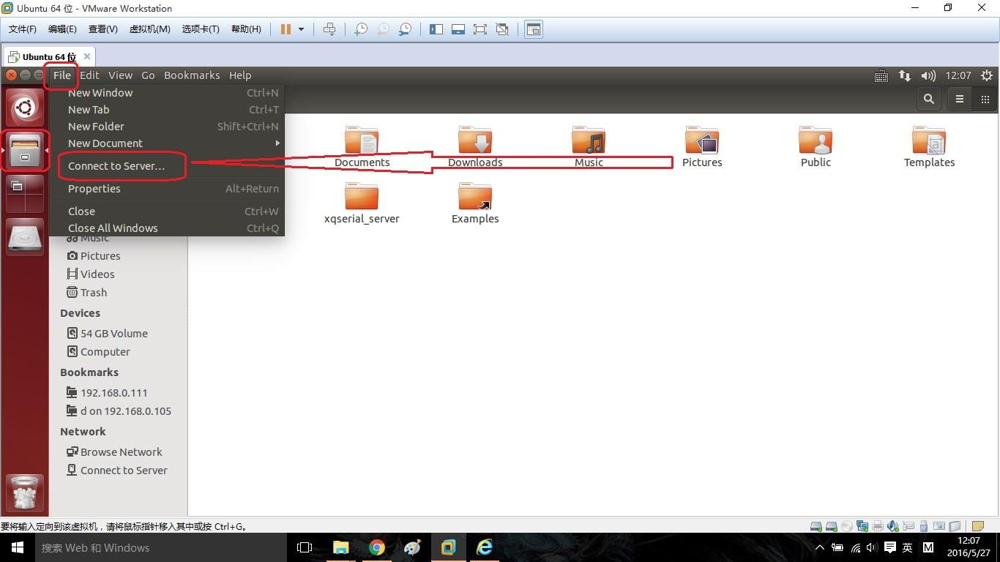
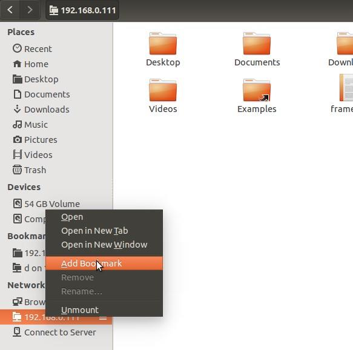
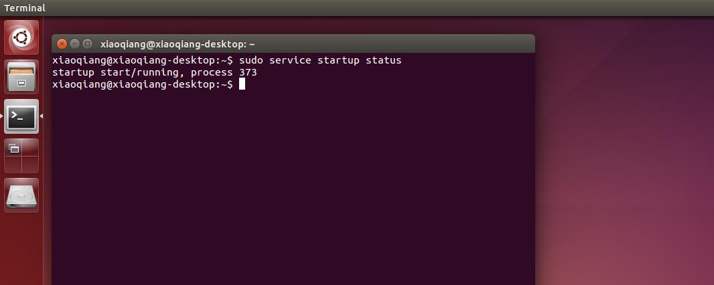
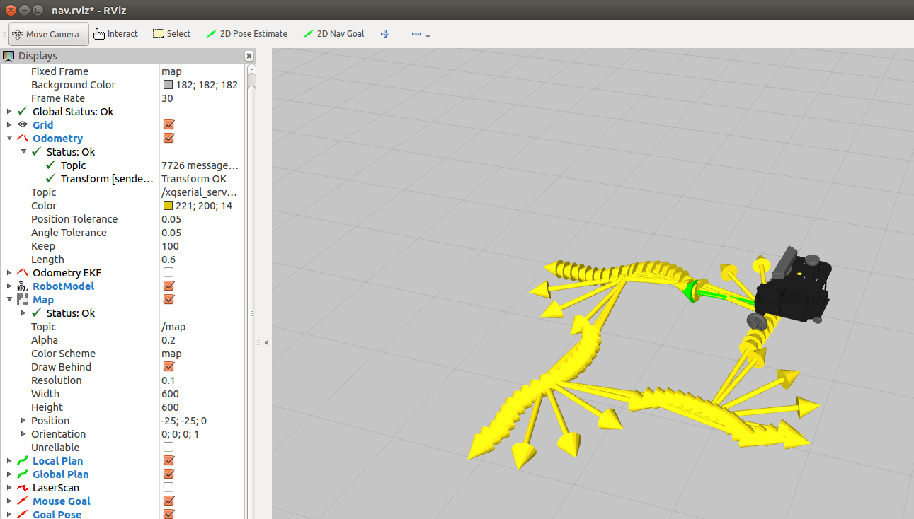
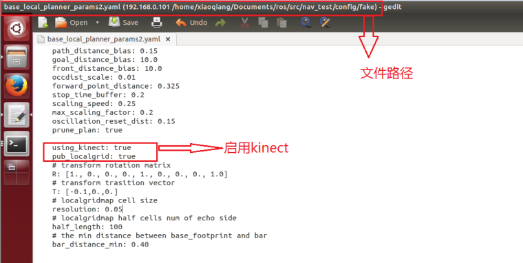
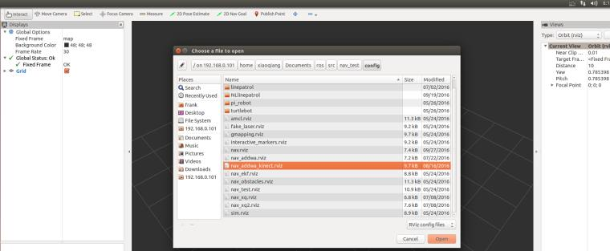
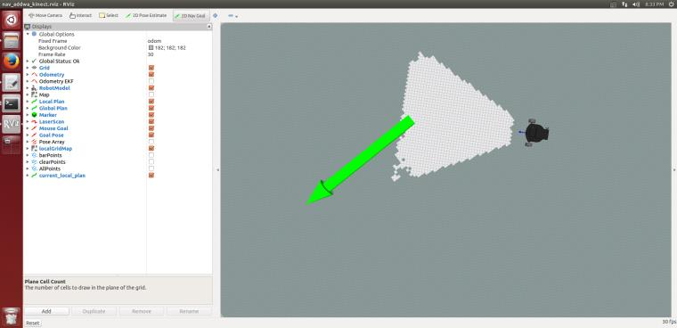

# ROS—XiaoQiang机器人使用教程
## 一.使用前的准备
### 1.设置网络
首先将小强的主机连接上电脑显示器使用 HDMI 到 VGA 转接头进行连接, 小强的默认密码是 **xiaoqiang** 进入系统连接路由器。
```
WIFI名称为：
TP-LINK_xiaoqiang
密码为：
xiaoqiang
已分配给小强机器人的静态IP为：
192.168.1.101
```
###**注意**
若重新设置路由器请参照`小强ROS机器人用户手册——综合版`进行设置，设置内容包括：
1. 为ROS机器人分配静态IP，方便以后连接
2. **将路由器的无线设置中的信道设为1-11之间，否则小强机器人搜索不到路由器信号。（重要）** [*参考链接*](https://askubuntu.com/questions/645287/cant-find-specific-wifi-network-ubuntu-14-04?noredirect=1&lq=1)
### 2. 本地遥控端设置
1. 配置本地Ubuntu 14.04系统  
2. 安装SSH SCREEN  
```
sudo apt-get install ssh screen
```
3. 安装 ROS JADE 版本
4. 添加远程目录  
因为后续需要经常操作更改小强主机上的文件,现在我们将小强主机远程目录添加到本地遥控端,这样在本地就可以直接图形化操作小强主机上的文件(小强主机相当于本地Ubuntu 系统的外挂硬盘)  
点击下图位置,添加小强远程目录

输入小强远程目录,请将 ip 换成上文提到的实际 ip 地址 `192.168.1.101`

根据提示输入小强主机用户名和密码  
一切正常的话,已经打开了小强主机的 home 目录,为了未来使用方便,可以将这个地址添加到 bookmark

下次直接点击这个 bookmark,就能访问小强主机的 home 目录


5. 配置完成,开始使用   

(1)在本地遥控端打开一个命令终端   
(2)通过 ssh 连接小强,请将 xxx 换成实际的 ip
```
ssh xiaoqiang@xxx.xxx.xxx.xxx
即：
ssh xiaoqiang@192.168.1.101
或：
ssh -X xiaoqiang@192.168.1.101 (该命令可在本地遥控端使用图形界面)
```
(3)启动遥控程序
```
rosrun nav_test control.py
```
(4)可以开始通过方向键来控制小强的移动了。空格键是停止。 Ctrl + C 退出程序。
## 二.教程——蓝鲸智能开源软件仓库的使用和 ROS 开机启动任务的配置
小强的所有软件源码都共享在蓝鲸智能的开源仓库里,任何人任何组织都可以自由下载使用或进行二次开发,  [**软件仓库地址**](https://github.com/BlueWhaleRobot)  
开源仓库中的软件可以直接 git clone 到小强的 ROS 工作目录里,然后就可以直接用 ROS 的工具链 catkin_make 编译使用。  
小强的 ROS 工作目录为:/home/xiaoqiang/Documents/ros/src
1. STARTUP 软件包功能介绍  
小强主机开机后,会自动启动名字为 startup 的 linux 服务脚本,startup 服务脚本运行时会去启动 startup 软件包中的startup.launch 文件 在 ubuntu 系统中注册的复制品。因此我们通过修改startup 软件包中的 startup.launch 文件,然后将这个文件在 ubuntu 系统中注册为 startup 服务,就能控制小强主机的开机启动任务了。
2. 在小强主机中下载安装 STARTUP 软件包  
a.在本地遥控端 ssh 连接小强主机,参考上篇教程的配置
```
ssh xiaoqiang@192.168.1.101
```
b.进入小强 ROS 工作目录,查看是否有 startup 文件夹
cd Documents /ros/src/
ls
如果存在,说明已安装好 startup 软件包,可以直接进行下面的操作三
如果想和开源仓库同步更新这个 startup 软件包,请输入如下命令
```
cd startup
git stash
git pull
cd ..
```
3. 修改软件包中 LAUNCH 文件夹内的 STARTUP.LAUNCH 文件  
利用上篇教程安装的 atom 编辑器,在本地遥控端直接编辑这个文件(需要远程
访问小强的主机文件目录,请参考上篇基础操作教程进行配置)

在上图箭头区域,添加或删除你需要启动的 ROS launch 文件及 ROS node,这些项目在下文将被添加进小强主机的开机启动项里,小强下次开机会自动运行这些项目。最后保存退出
4. 将 STARTUP.LAUNCH 文件在小强主机中注册为 STARTUP 开机启动服务  
接着二中的 ssh 窗口输入  
a.首先将之前注册的 startup 服务停止和删除
```
sudo service startup
rosrun robot_upstart stop uninstall startup
```
b.重新注册 startup 开机启动服务
```
rosrun robot_upstart install startup/launch/startup.launch
```
5. 远程重启小强主机,查看开机启动项是否正常加载  
接着上文的 ssh 窗口输入  
a.下发重启命令
```
sudo shutdown -r now
```
b.重新 ssh 连接
```
ssh xiaoqiang@192.168.1.101
```
c.查看 startup 服务状态
```
sudo service startup status
```
正常的话会显示 startup start/running 如下图所示

d.还可以进一步查看相关的 topic 是否已经发布出来
```
rostopic list
```
## 三.在 rviz 中显示小强机器人模型
将小强主机接入显示器和键盘,开机后,打开终端,先关闭开机任务
```
sudo service startup stop
roscore
```
在小强主机上新开一个终端,启动这个软件包
```
roslaunch xiaoqiang_udrf display.launch
```


此时发现没有任何显示,需要添加 rviz 显示项目


还是有问题,整个模型透明发白,这是因为 rivz 中的全局坐标系“fixed frame”设置的不合适,将 map 改成 base_link 后即可正常显示

现在操作右上角的滑动条就可以使相应的轮子转动。
修改 xiaoqiang_udrf 文件夹内的 display.launch 文件 ,false 改 true


## 四.惯性导航自主移动测试
接下来开始测试小强的惯性导航功能。这里的惯性导航,是指利用小强自身佩戴的惯性传感器(加速度和陀螺仪)和底盘编码器信息进行定位和移动。需要的 ROS 软件包有:1.底层驱动 xqserial_server, 2.机器人模型包 xiaoqiang_udrf, 3.惯性导航测试软件包 nav_test.
1. ssh 方式在小强主机上完成的操作  
请确保小强已经正常启动,小强主机正常启动完成后会自动运行上面提到的三个软件包,不需要手工启动相应的 luanch 文件。  
a. 新开一个终端,启动导航基础程序  **(ssh登录小强命令终端)**
```
ssh -X xiaoqiang@192.168.xxx.xxx
roslaunch nav_test fake_move_base_blank_map.launch
```
b. 新开一个终端,检查是否所有 tf 都已经就位 **(ssh登录小强命令终端)**
```
ssh -X xiaoqiang@192.168.xxx.xxx
rosrun tf view_frames evince frames.pdf
```
正常会显示下图

2. 在本地遥控端上完成的操作  
本地遥控端必须是安装好 ROS jade 版本的 ubuntu 系统,同时保证和小强主机在同一个局域网内。因为需要在本地窗口用 rviz 显示
小强姿态和路径轨迹(ssh 中不能直接打开 rviz),  所以需要使用 ros 的分布式网络配置方案。  
同时在本地遥控端也需要安装好机器人模型包 xiaoqiang_udrf。  
概括来说:本地遥控端打开自己的 rviz,接收显示小强主机上的 topic,而小强模型数据则直接从本地获取。  
具体过程如下:

a.在本地开一个命令行终端,在本地的 hosts 文件内添加小强的 ip **(本地的命令终端)**
```
sudo gedit /etc/hosts
添加
xxx.xxx.xxx.xxx xiaoqiang-desktop #请将 xx 改成小强的实际 ip 地址
即
192.168.1.101 xiaoqiang-desktop
```
b.新开一个命令终端输入 **(本地的命令终端)**
```
export ROS_MASTER_URI=http://xiaoqiang-desktop:11311
```
继续执行
```
rostopic list
```
如果可以看到小强的 topic 了,就说明配置成功。  
c. 安装模型软件包,更新本地 ROS包环境变量,因为需要从本地读取模型数据 **（本地的命令终端）**
```
mkdir ~/Documents/ros/src
cd ~/Documents/ros/src
catkin_init_workspace
git clone https://github.com/BlueWhaleRobot/xiaoqiang_udrf.git
#切换到 master 分支
cd xiaoqiang_udrf
git checkout master
#编译完成安装
cd ..
cd ..
catkin_make
```
d.打开 rviz 图形界面  **(本地的命令终端)**
```
source ~/Documents/ros/devel/setup.sh
export ROS_MASTER_URI=http://xiaoqiang-desktop:11311
rviz
```
当窗口打开后,点击左上角的 file->open,选择小强里的  
``/home/xiaoqiang/Documents/ros/src/nav_test/config/nav.rviz 文件。``  
这时界面应该如下图显示,关于如何访问小强主机上的文件,请参考之前的教程。

3. 在小强主机远程 ssh 窗口内完成最后操作  **(ssh登录小强命令终端)**
```
rosrun nav_test square.py
```
演示结果如下图所示  



## 五.kinect1 代 ROS 驱动测试与安装
1. LIBFREENECT 测试
将小强主机接入显示器和键盘,在小强主机上新开一个命令终端输入
```
freenect-glview
```
可以看到如下图的类似界面
  
2. ROS 驱动测试  
关闭步骤 1 中的程序,新开一个命令窗口,使用 freenect_launch 启动相关 kinect 节点  
```
roslaunch freenect_launch
freenect-xyz.launch
```
新开 1 个窗口打开 rviz
```
rviz
```
选择需要显示的内容,例如 kinect 的 rgb 图像和深度点云,显示效果如下


kienct 各项功能的开启在  
`/home/xiaoqiang/Documents/ros/src/freenect_stack/freenect_launch/launch/examples/freenect -xyz.launch` 里


通过设置 true 或者 false 来开启、关闭相应功能

## 六.使用 rostopic 控制 kinect 的俯仰角度

**准备工作 :**  

请查看 kinect 版本,在 kinect 底座标签上有注明，型号为 model1414   

**操作步骤 :**

1. 在本地虚拟机新开一个窗口,启动 freenect_stack 驱动。  
ssh 登入小车主机  
```
ssh -X xiaoqiang@192.168.1.101
roslaunch freenect_launch freenect-xyz.launch
```
正常启动会出现下图,如果出现红色错误(驱动缺陷),请 ctrl+c 关闭命令后等待 6 秒(真的
需要 6 秒),再次尝试允许上面的 roslaunch 命令。


2. 在本地虚拟机新开一个窗口,发布电机角度控制命令  
ssh 登入小车主机
```
ssh -X xiaoqiang@192.168.1.101
rostopic pub /set_tilt_degree std_msgs/Int16 '{data: -20}' -r 1
```
如果一切正常,现在可以看到 kinect 的仰角不断变小,上述命令中的{data: -20}数字就代表角
度,可以设置为 30 到-30 之间的整数

## 七.使用 kinect 进行自主移动避障
**原理 :**  
freenct_stack 包提供 kinect 驱动,其发布的点云通过 image_pipeline 转换成障碍物栅格分布图。
nav_test 软件包启动底盘导航程序后会自动处理分析障碍物分布图,之后根据 rivz 发布的目标
导航点自主移动。

**操作步骤 :**  
1. 配置小车主机和本地虚拟机的 hosts 文件,使两者能互相访问对应的 ros 数据  

A. 配置本地虚拟机  
```
sudo gedit /etc/hosts
```
将下图中的 ip 地址换成小车实际数值


B. 配置小车主机
局域网 ssh 登入小车主机
```
ssh -X xiaoqiang@192.168.1.101
sudo gedit /etc/hosts
```
将下图中的 ip 地址换成本地虚拟机实际数值,主机名称改为虚拟机名称


2. 在本地虚拟机中新开 3 个窗口,分别 ssh 登入小车,启动原理部分提及的相关软件包

A. SSH 登入 **(三个窗口均为SSH登录小强的命令终端)**

```
命令均为；
ssh -X xiaoqiang@192.168.1.101 (与截图中的不一致)
```
B. 在第一个窗口启动 KINECT 驱动
```
roslaunch freenect_launch kinect-xyz.launch
```
C. 在第二个窗口设置 KINECT 俯仰角, **这个角度不是任意的**
```
rostopic pub /set_tilt_degree std_msgs/Int16 '{data: -19}' -r 1
```
D. 编辑底盘导航程序配置文件  
`/HOME/XIAOQIANG/DOCUMENTS/ROS/SRC/NAV_TEST/CONFIG/FAKE/BASE_LOCAL_PLANNER_P
ARAMS2.YAML` ,使能 KINECT



E. 在第三个窗口启动底盘导航程序
```
roslaunch nav_test fake_move_base_blank_map.launch
```
F. 全部正常,会出现类似下图的界面,到此小车端配置启动完成


3. 在本地虚拟机中新开 1 个窗口,用来启动 rviz  

A 加入 ROS 局域网后,打开 RVIZ **(本地的命令终端)**
```
export ROS_MASTER_URI=http://xiaoqiang-desktop:11311
rviz
```


B. 点击 RVIZ 界面左上角的 OPEN CONFIG ,选择小车主机上的
`/HOME/XIAOQIANG/DOCUMENTS/ROS/SRC/NAV_TEST/CONFIG/NAV_ADDWA_KINECT.RVIZ` 配置
文件



C. 正常的话,现在 RVIZ 中将出现类似下图的画面,现在所有配置都已经完成,开始发布导航目标点


D. 发布一个目标点,小车会开始自主移动



E. 小车到达目标点,请继续尝试其它位置


## 八. kinect 跟随包 turtlebot_follower

**TURTLEBOT_FOLLOWER 利用深度摄像头反馈的点云图,计算一定区域内的点云中
心坐标作为目标跟随点,根据这个坐标和设置的安全距离控制底盘移动实现跟
随功能。**
