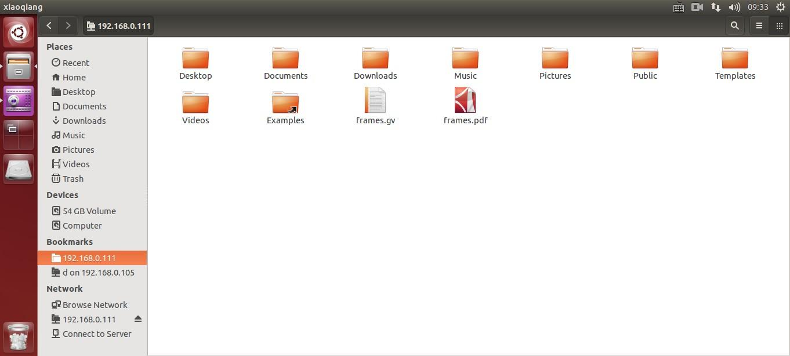
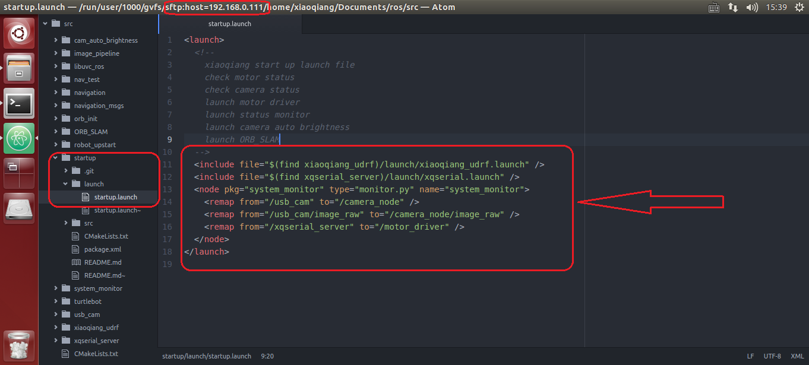
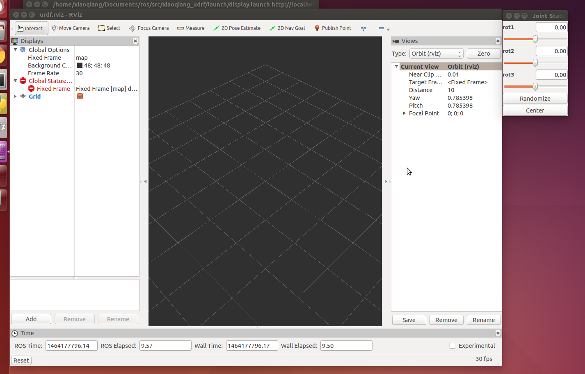
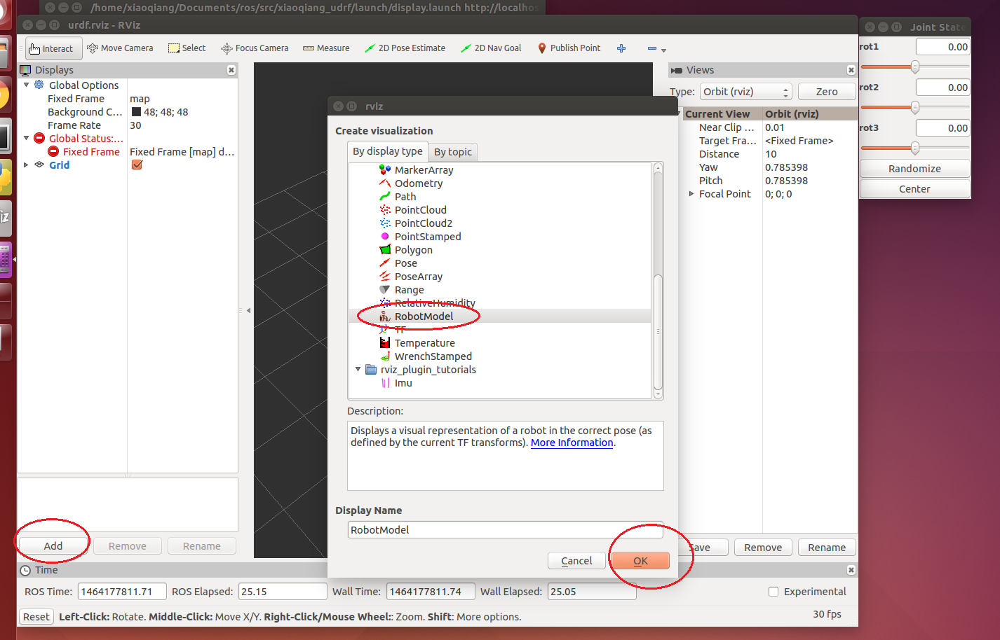
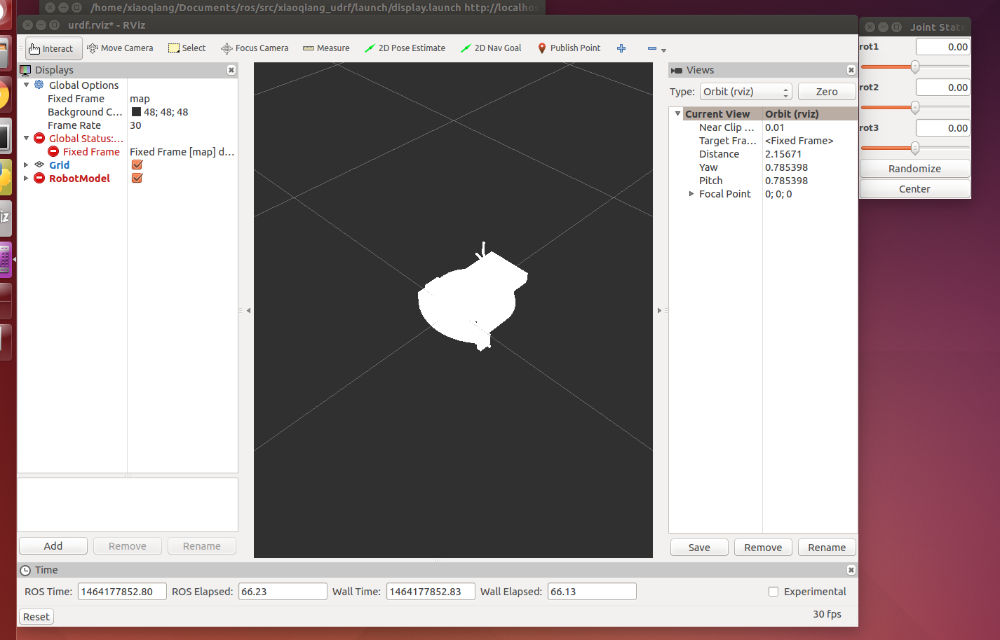
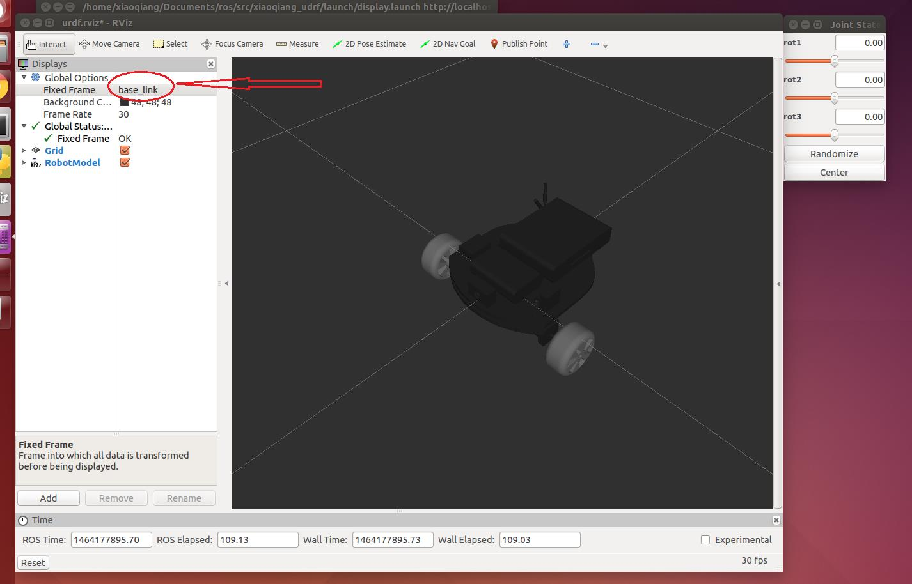
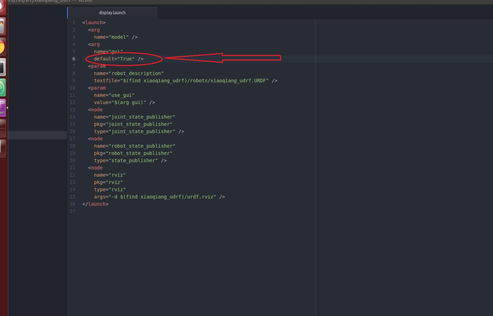
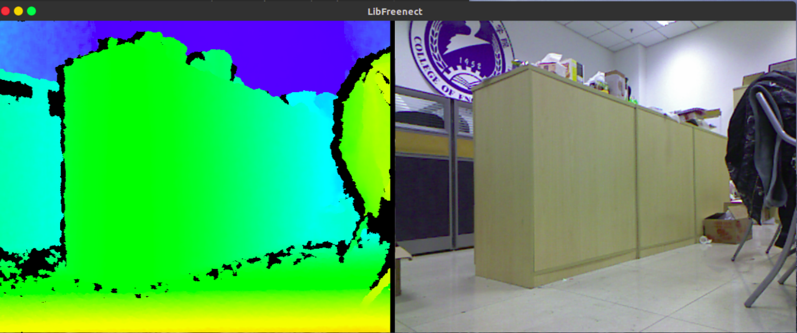
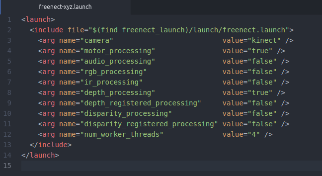
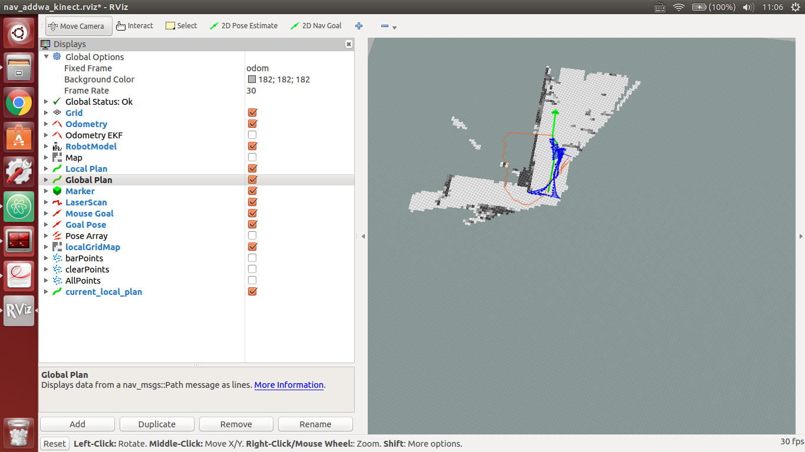

# ROS—XiaoQiang机器人使用教程
## 写在前面
该机器人原系统为14.04，在将其升级到16.04时，我主要遇到了以下几个问题。
1. ssh连接时出现
```
@    WARNING: REMOTE HOST IDENTIFICATION HAS CHANGED!     @
```
[解决该报错方法](http://blog.csdn.net/liuhang03/article/details/50323401)

2. 小强机器人的 **hostname** 需是 **xiaoqiang-desktop** `/etc/hosts` 文件中也要注意为
```
127.0.0.1	localhost
127.0.1.1	xiaoqiang-desktop
```
3. 在使用 ***Rviz*** 接收图像信息时，如果按照教程在 **open config** 对话框中找不到小强机器人对应的文件，则可以采用将相对应的 ***config文件*** 拷贝到遥控端电脑中打开的方式.
4. 若想要在 **Rviz** 中 ***显示小强机器人的模型示意图*** 则需要在打开Rviz前 source 遥控端电脑安装的小强机器人模型包的 setup.sh 文件
```
$ source ~/Documents/ros/devel/setup.sh
$ export ROS_MASTER_URI=http://xiaoqiang-desktop:11311
$ rviz
```
5. 激光雷达的安装方向要正确，***激光雷达的出线部分要对着机器人的尾部*** 否则无法用激光雷达构建地图。
安装方式如图所示：

## 教程正文
### 几点说明
1. 电脑终端为两台
* 一台为小强机器人上搭载的电脑终端
* 一台为操作者使用的安装有 **Ubuntu 16.04 与 ROS kinetic** 的电脑作为遥控端，用于显示小强机器人发送的数据与向小强机器人发布命令，下文以 ***遥控端*** 代称.

### 教程1 使用前的准备
1. 设置网络
首先将小强的主机连接上电脑显示器使用 HDMI 到 VGA 转接头进行连接, 小强的默认密码是 **xiaoqiang** 进入系统连接路由器。
```
WIFI名称为：
TP-LINK_xiaoqiang
密码为：
xiaoqiang
已分配给小强机器人的静态IP为：
192.168.1.101
```
#### **注意**
若重新设置路由器请参照`小强ROS机器人用户手册——综合版`进行设置，设置内容包括：
a. 为ROS机器人分配静态IP，方便以后连接
b. **将路由器的无线设置中的信道设为1-11之间，否则小强机器人搜索不到路由器信号。（重要）** [*参考链接*](https://askubuntu.com/questions/645287/cant-find-specific-wifi-network-ubuntu-14-04?noredirect=1&lq=1)

2. 本地遥控端设置
a. 配置本地Ubuntu 16.04 系统  
b. 安装SSH SCREEN  
```
$ sudo apt-get install ssh screen
```
3. 安装 ROS Kinetic 版本
4. 添加远程目录  
因为后续需要经常操作更改小强主机上的文件,现在我们将小强主机远程目录添加到本地遥控端,这样在本地就可以直接图形化操作小强主机上的文件(小强主机相当于本地Ubuntu 系统的外挂硬盘)  
点击下图位置,添加小强远程目录

输入小强远程目录,请将 ip 换成上文提到的实际 ip 地址 `192.168.1.101`

根据提示输入小强主机用户名和密码  
一切正常的话,已经打开了小强主机的 home 目录,为了未来使用方便,可以将这个地址添加到 bookmark

下次直接点击这个 bookmark,就能访问小强主机的 home 目录


5. 遥控端电脑通过 *ssh* 与小强机器人连接
```
$ ssh xiaoqiang@192.168.1.101
```
* 启动遥控程序
```
$ rosrun nav_test control.py
```
可以通过方向键来控制小强的移动了。空格键是停止。Ctrl + C 退出程序
* 在遥控端系统的 `/etc/hosts` 文件中添加小强的ip
```
192.168.1.101 xiaoqiang-desktop
```
* 在小强终端中添加遥控端的ip地址
```
$ ssh -X xiaoqiang@192.168.1.101
$ sudo gedit /etc/hosts
```
输入WiFi分配给遥控端的IP地址（IP地址可在网络设置的连接信息中查到）
eg：192.168.1.xxx （遥控端计算机名）
* 视频传输
在遥控端打开一个终端输入
```
$ export ROS_MASTER_URI=http://xiaoqiang-desktop:11311
$ rosrun image_view image_view image:=/camera_node/image_raw _image_transport:=compressed
```
如果一切正常就能够看到当前小强的摄像头画面了

### 教程2 蓝鲸智能开源软件仓库的使用和 ROS 开机启动任务的配置
小强的所有软件源码都共享在蓝鲸智能的开源仓库里,任何人任何组织都可以自由下载使用或进行二次开发,  [*软件仓库地址*](https://github.com/BlueWhaleRobot)  
开源仓库中的软件可以直接 git clone 到小强的 ROS 工作目录里,然后就可以直接用 ROS 的工具链 `catkin_make` 编译使用。小强的 ROS 工作目录为:`/home/xiaoqiang/Documents/ros/src`
1. STARTUP 软件包功能介绍  
小强主机开机后,会自动启动名字为 startup 的 linux 服务脚本, startup 服务脚本运行时会去启动 startup 软件包中的startup.launch 文件 在 ubuntu 系统中注册的复制品。因此我们通过修改startup 软件包中的 startup.launch 文件,然后将这个文件在 ubuntu 系统中注册为 startup 服务,就能控制小强主机的开机启动任务了。
2. 在小强主机中下载安装 STARTUP 软件包  

a. 在本地遥控端 ssh 连接小强主机,参考上篇教程的配置
```
$ ssh xiaoqiang@192.168.1.101
```
b.进入小强 ROS 工作目录,查看是否有 startup 文件夹
```
$ cd Documents /ros/src/
$ ls
```
如果存在,说明已安装好 startup 软件包,可以直接进行下面的操作3
如果想和开源仓库同步更新这个 startup 软件包,请输入如下命令
```
$ cd startup
$ git stash
$ git pull
$ cd ..
```
3. 修改软件包中 LAUNCH 文件夹内的 STARTUP.LAUNCH 文件  
利用上篇教程安装的 atom 编辑器,在本地遥控端直接编辑这个文件(需要远程访问小强的主机文件目录,请参考上篇基础操作教程进行配置)

在上图箭头区域,添加或删除你需要启动的 ROS launch 文件及 ROS node,这些项目在下文将被添加进小强主机的开机启动项里,小强下次开机会自动运行这些项目。最后保存退出
4. 将 `startup.launch` 文件在小强主机中注册为 STARTUP 开机启动服务  
接着二中的 ssh 窗口输入  

a. 首先将之前注册的 startup 服务停止和删除
```
$ sudo service startup
$ rosrun robot_upstart stop uninstall startup
```
b. 重新注册 startup 开机启动服务
```
$ rosrun robot_upstart install startup/launch/startup.launch
```
5. 远程重启小强主机,查看开机启动项是否正常加载  
接着上文的 ssh 窗口输入  

a. 下发重启命令
```
$ sudo shutdown -r now
```
b. 重新 ssh 连接
```
$ ssh xiaoqiang@192.168.1.101
```
c. 查看 startup 服务状态
```
$ sudo service startup status
```
正常的话会显示 `startup start/running` 如下图所示


d. 还可以进一步查看相关的 topic 是否已经发布出来
```
$ rostopic list
```
### 教程3 在 rviz 中显示小强机器人模型
将小强主机接入显示器和键盘,开机后,打开终端,先关闭开机任务
```
$ sudo service startup stop
$ roscore
```
在小强主机上新开一个终端,启动这个软件包
```
$ roslaunch xiaoqiang_udrf display.launch
```


此时发现没有任何显示,需要添加 rviz 显示项目


还是有问题,整个模型透明发白,这是因为 rivz 中的全局坐标系“fixed frame”设置的不合适,将 map 改成 base_link 后即可正常显示

现在操作右上角的滑动条就可以使相应的轮子转动。
修改 `xiaoqiang_udrf` 文件夹内的 `display.launch` 文件 ,false 改 true


### 教程4 惯性导航自主测试
接下来开始测试小强的惯性导航功能。这里的惯性导航,是指利用小强自身佩戴的惯性传感器(加速度和陀螺仪)和底盘编码器信息进行定位和移动。需要的 ROS 软件包有:1.底层驱动 xqserial_server, 2.机器人模型包 xiaoqiang_udrf, 3.惯性导航测试软件包 nav_test.

1. 在遥控端通过ssh登录小强主机完成的操作

a. 在遥控端新开一个终端,启动导航基础程序
```
$ ssh -X xiaoqiang@192.168.1.101
$ roslaunch nav_test fake_move_base_blank_map.launch
```
b. 在遥控端新开一个终端,检查是否所有 tf 都已经就位
```
$ ssh -X xiaoqiang@192.168.xxx.xxx
$ rosrun tf view_frames evince frames.pdf
```
2. 在本地遥控端上完成的操作  
本地遥控端必须是安装好 ROS jade 版本的 ubuntu 系统,同时保证和小强主机在同一个局域网内。因为需要在本地窗口用 rviz 显示
小强姿态和路径轨迹(ssh 中不能直接打开 rviz),  所以需要使用 ros 的分布式网络配置方案。  
同时在本地遥控端也需要安装好机器人模型包 xiaoqiang_udrf。  
概括来说:本地遥控端打开自己的 rviz,接收显示小强主机上的 topic,而小强模型数据则直接从本地获取。  
具体过程如下:

a.在本地开一个命令行终端,在本地的 hosts 文件内添加小强的 ip **(本地的命令终端)**
```
$ sudo gedit /etc/hosts
添加
xxx.xxx.xxx.xxx xiaoqiang-desktop #请将 xx 改成小强的实际 ip 地址
即
192.168.1.101 xiaoqiang-desktop
```
b.新开一个命令终端输入 **(本地的命令终端)**
```
$ export ROS_MASTER_URI=http://xiaoqiang-desktop:11311
```
继续执行
```
$ rostopic list
```
如果可以看到小强的 topic 了,就说明配置成功。  
c. 安装模型软件包,更新本地 ROS包环境变量,因为需要从本地读取模型数据 **（本地的命令终端）**
```
$ mkdir ~/Documents/ros/src
$ cd ~/Documents/ros/src
$ catkin_init_workspace
$ git clone https://github.com/BlueWhaleRobot/xiaoqiang_udrf.git
#切换到 master 分支
$ cd xiaoqiang_udrf
$ git checkout master
#编译完成安装
$ cd ..
$ cd ..
$ catkin_make
```
d.打开 rviz 图形界面  **(本地的命令终端)**
```
$ source ~/Documents/ros/devel/setup.sh
$ export ROS_MASTER_URI=http://xiaoqiang-desktop:11311
$ rviz
```
当窗口打开后,点击左上角的 file->open,选择小强里的
/home/xiaoqiang/Documents/ros/src/nav_test/config/nav.rviz 文件
***若无法访问小强机器人的工作目录，则可以选择将配置文件复制到遥控端电脑***

4. 在小强终端的远程ssh窗口内输入命令
```
$ rosrun nav_test square.py
```
演示结果如下图所示  


### 教程8 kinect 1代 ROS 驱动测试与安装

1. LIBFREENECT 测试
将小强主机接入显示器和键盘,在小强主机上新开一个命令终端输入
```
$ freenect-glview
```
可以看到如下图的类似界面
  

2. ROS 驱动测试  
关闭步骤 1 中的程序,新开一个命令窗口,使用 freenect_launch 启动相关 kinect 节点  
```
$ roslaunch freenect_launch
$ freenect-xyz.launch
```
新开 1 个窗口打开 rviz
```
$ rviz
```
选择需要显示的内容,例如 kinect 的 rgb 图像和深度点云,显示效果如下


kienct 各项功能的开启在  
`/home/xiaoqiang/Documents/ros/src/freenect_stack/freenect_launch/launch/examples/freenect -xyz.launch` 里


通过设置 true 或者 false 来开启、关闭相应功能

### 教程9 使用 rostopic 控制 kinect 的俯仰角度

**准备工作 :**  

请查看 kinect 版本,在 kinect 底座标签上有注明，型号为 `model1414` 为 kinect 1代   

**操作步骤 :**

1. 在本地虚拟机新开一个窗口,启动 freenect_stack 驱动。  
ssh 登入小车主机  
```
$ ssh -X xiaoqiang@192.168.1.101
$ roslaunch freenect_launch freenect-xyz.launch
```
正常启动会出现下图,如果出现红色错误(驱动缺陷),请 ctrl+c 关闭命令后等待 6 秒(真的
需要 6 秒),再次尝试允许上面的 roslaunch 命令。


2. 在本地虚拟机新开一个窗口,发布电机角度控制命令  
ssh 登入小车主机
```
$ ssh -X xiaoqiang@192.168.1.101
$ rostopic pub /set_tilt_degree std_msgs/Int16 '{data: -20}' -r 1
```
如果一切正常,现在可以看到 kinect 的仰角不断变小,上述命令中的{data: -20}数字就代表角
度,可以设置为 30 到-30 之间的整数

### 教程10 使用 kinect 进行自主移动避障
**原理 :**  
freenct_stack 包提供 kinect 驱动,其发布的点云通过 image_pipeline 转换成障碍物栅格分布图。
nav_test 软件包启动底盘导航程序后会自动处理分析障碍物分布图,之后根据 rivz 发布的目标
导航点自主移动。

**操作步骤 :**  
1. 在遥控端开启三个终端窗口，并分别 ssh 登入小车
* 第一个窗口启动 KINECT 驱动
```
$ ssh -X xiaoqiang@192.168.1.101
$ roslaunch freenect_launch kinect-xyz.launch
```
* 第二个窗口设置 KINECT 俯仰角, **这个角度不是任意的**
```
$ ssh -X xiaoqiang@192.168.1.101
$ rostopic pub /set_tilt_degree std_msgs/Int16 '{data: -19}' -r 1
```
* 第三个窗口启动底盘导航程序
```
$ ssh -X xiaoqiang@192.168.1.101
$ roslaunch nav_test fake_move_base_blank_map.launch
```
* 编辑底盘导航程序配置文件  
`/HOME/XIAOQIANG/DOCUMENTS/ROS/SRC/NAV_TEST/CONFIG/FAKE/BASE_LOCAL_PLANNER_P
ARAMS2.YAML` ,使能 KINECT


2. 启动 Rviz
* 打开一个遥控端窗口
```
$ source ~/Documents/ros/devel/setup.sh
$ export ROS_MASTER_URI=http://xiaoqiang-desktop:11311
$ rviz
```
* 打开配置文件
点 击 RVIZ 界 面 左 上 角 的 OPEN CONFIG , 选 择 小 车 主 机 上 的
`/HOME/XIAOQIANG/DOCUMENTS/ROS/SRC/NAV_TEST/CONFIG/NAV_ADDWA_KINECT.RVIZ` 配置文件


3. 此时可在 Rviz 界面中发布2维导航点




### 教程13 rplidar 二代激光雷达的使用暨利用 udev 给小车增加串口设备
小车主机和底盘的通信是通过串口实现的,在实际开发过程中我们可能会给小车增加串口外设,这会导致串口号(TTYUSB)的混乱,引发小车底盘 ROS 驱动和串口设备的异常。下文将以 RPLIDAR 二代激光雷达为例,演示通过修改 UDEV 文件指定设备串口号的方式解决串口
冲突问题。 [*方法依据*](http://wirespeed.xs4all.nl/mediawiki/index.php/Udev_rules_file_for_Arduino_boards)

1. 查看各个串口设备的 ID
```
$ sudo apt-get install expect-dev
$ unbuffer udevadm monitor --environment | grep 'ID_SERIAL='
```
将底盘通信u转串重新插拔一下,终端会打印出此设备的ID信息,例如下图:  
`Prolific_Technology_Inc._USB-Serial_Controller"`  
再将激光雷达的 usb 适配器重新插入主机,终端也会打印出激光雷达的ID信息,例如下图:
`"Silicon_Labs_CP2102_USB_to_UART_Bridge_Controller_0001"`


2. 根据获取的串口设备的 ID,建立 UDEV 规则文件,将底盘通信U转串指定为TTYUSB001,将激光雷达指定为 TTYUSB002
```
$ sudo gedit /etc/udev/rules.d/ 60 -persistent-serial.rules
```
输入下面内容后保存,请将文中 ID_SERIAL 后面的字符串换成步骤1中获取的 ID将`60-persistent-serial.rules`中的内容修改成如下所示 [*udev方法出处*](http://wirespeed.xs4all.nl/mediawiki/index.php/Udev_rules_file_for_Arduino_boards)
```
ACTION!= "add" ,
GOTO = "persistent_serial_end"
SUBSYSTEM!= "tty" ,
GOTO = "persistent_serial_end"
KERNEL!= "ttyUSB[0-9]*" ,
GOTO = "persistent_serial_end"
# This is old 11.10 style: IMPORT="usb_id --export %p"
IMPORT{builtin}= "path_id"
ENV{ID_SERIAL}== "Prolific_Technology_Inc._USB-Serial_Controller", SYMLINK= "stm32Car", SYMLINK+="ttyUSB001" , OWNER= "xiaoqiang"
ENV{ID_SERIAL}== "Silicon_Labs_CP2102_USB_to_UART_Bridge_Controller_0001" , SYMLINK= "rplidarA2", SYMLINK+= "ttyUSB002" , OWNER= "xiaoqiang"
LABEL= "persistent_serial_end"
```
更新系统 udev 规则
```
$ sudo udevadm control –reload
```
重新插拔所有 usb 串口设备,现在底盘通信u转串成功被识别为 ttyUSB001、激光雷达被识别
为 ttyUSB002,与设备插入顺序和端口无关。
```
$ ls /dev
```
可查看设备号，如下图所示：  


3. 修改小车底盘 ROS 驱动节点 LAUNCH 文件,将通信设备指定为上文设置的TTYUSB001路径`Documents/ros/src/xqserial_server/`
4. 修改 RPLIDAR 二代激光的 ROS 驱动节点 LAUNCH 文件,将通信设备指定为上文设置的 TTYUSB002  


*激光雷达驱动的安装*  
```
$ cd ~/Documents/ros/src
$ git clone https://github.com/BlueWhaleRobot/rplidar_ros.git
$ cd ..
$ catkin_make
```
5. 重启小车,现在已经可以同时正常使用激光雷达和小车底盘,例如运行下述命令测试激光雷达
```
$ roslaunch rplidar_ros view_rplidar.launch
```

### 教程14 在 gmapping 下使用激光雷达 rplidar a2 进行建图
1. 启动 gmapping 节点
```
$ ssh -X xiaoqiang@192.168.1.101
$ roslaunch gmapping slam_gmapping_xiaoqiang_rplidar_a2.launch
```
2. 打开 Rviz
```
$ source ~/Documents/ros/devel/setup.sh
$ export ROS_MASTER_URI=http://xiaoqiang-desktop:11311
$ rviz
```
打开小强 ros 工作目录下的`slam_gmapping/gmapping/launch/rplidar_a2_test.rviz` 配置文件

3. 遥控小强机器人开始建图
* 遥控端遥控小强机器人建图
```
$ ssh -X xiaoqiang@192.168.1.101
$ rosrun nav_test control.py
```
* 安卓手机遥控小强机器人建图
[app 下载链接](http://community.bwbot.org/uploads/files/1487658064497-xiaoqiang-with-control.apk)

4. 保存地图
ssh 登录小强,在小强 home 目录下保存为 work6 开头的文件
```
$ ssh -X xiaoqiang@192.168.1.101
$ rosrun map_server map_saver -f work6
```
被建图环境与生成的地图如下图所示


### 教程15 AMCL 导航测试
将上一教程中在 `xiaoqiang` 目录下生成的地图文件`work6.pgm`以及`work6.yaml`复制到`/Documents/ros/src/nav_test/maps/`目录下。并修改`/Documents/ros/src/nav_test/launch/`目录下的`xiaoqiang_a2_demo_amcl.launch`文件，将
```
<arg name="map" default="work0.yaml" />
```
修改为
```
<arg name="map" default="work6.yaml" />
```
即在启动导航节点后会载入在上一教程中生成的`work6`地图。

1. 启动导航节点
```
$ ssh -X xiaoqiang@192.168.1.101
$ roslaunch nav_test xiaoqiang_a2_demo_amcl.launch
```
2. 启动 Rviz
```
$ source ~/Documents/ros/devel/setup.sh
$ export ROS_MASTER_URI=http://xiaoqiang-desktop:11311
$ rviz
```
打开小强 ROS 工作目录下的`NAV_TEST/CONFIG/XIAOQIANG_AMCL.RVIZ` 配置文件

***注意 在打开Rviz后请关闭 Odometry 下的 Covariance 防止卡顿***

3. 开始导航测试
a. 在 RVIZ 中使用 2D POSE ESTIMATION 设置机器人的初始 POSE 在 MAP 中的位置因为 AMCL 算法需要一个较为精确的初始值,才能进一步由当前雷达扫描点阵匹配出机器人在 MAP 中的真实位置。如下图教程附图所示


4. 实际操作如图所示，在 RVIZ 中使用 2D NAV GOAL 给小强发布目标点


5. 小强开始自主移动到指定位置


### 教程17 利用 ORB_SLAM2 建立环境三维模型
想要实现视觉导航,空间的三维模型是必须的。ORB_SLAM 就是一个非常有效的建立空间模型的算法。这个算法基于 ORB 特征点的识别，具有准确度高,运行效率高的特点。我们在原有算法的基础上进行了修改,增加了地图的保存和载入功能,使其更加适用于实际的应用场景。下面就介绍一下具体的使用方法。  
1. 启动 ORB_SLAM2
*首先更改配置文件*
ORB_SLAM2 的配置文件位于  
`/home/xiaoqiang/Documents/ros/workspace/src/ORB_SLAM2/Examples/ROS/orb_slam2/Data`   
文件夹内。更改 setting.yaml 其中的 LoadMap 的值,将其设置为 0。当设置为 1 的时候程序会在启动后自动从/home/xiaoqiang/slamdb 文件夹内载入地图数据。当设置成 0 时,就不会载入地图数据。由于我们是要创建地图,所以LoadMap 要设置为 0。

打开遥控端的终端，输入以下命令
```
$ ssh -X xiaoqiang@192.168.1.101
$ roslaunch orb_slam2 start.launch
```
2. 开始建立环境三维模型
打开小强图传遥控 windows 客户端,点击“未连接“按钮连接小强。在图传窗口右键打开”原始图像“和”ORB_SLAM2 的特征点图像“


上图中,左侧图像是摄像头原始彩色图像,右侧是 ORB_SLAM2 处理后的黑白图像。当前 ORB_SLAM2 还没有初始化成功,所以黑白图像没有特征点。按住”w”键开始遥控小强往前缓慢移动,使 ORB_SLAM2 初始化成功,即黑白图像开始出现红绿色特征点现在就可以开始遥控小强对周围环境建图,遥控过程中需要保证黑白图像一直存在红绿色特征点,不存在则说明视觉 lost 了,需要遥控小强退回到上次没 lost
的地方找回视觉位置。

3. 使用 rviz 查看建图效果
```
$ source ~/Documents/ros/devel/setup.sh
$ export ROS_MASTER_URI=http://xiaoqiang-desktop:11311
$ rviz
```
打开 `/home/xiaoqiang/Documents/ros/src/ORB_SLAM/Data/rivz.rviz` 配置文件，查看建图效果

4. 保存地图

当地图建立的范围满足自己要求后,在虚拟机新开一个命令窗口,输入下列命令保存地图
```
ssh -X xiaoqiang@192.168.1.101
rostopic pub /map_save std_msgs/Bool '{data: true}' -r 0.1
```
这个命令每隔 10s 触发 1 次保存任务,因此当看到下图时,请关闭上面的窗口  
在虚拟机新开一个命令窗口,输入下列命令侦测地图保存命令有没有发出
```
$ ssh -X xiaoqiang@192.168.1.101
$ rostopic echo /map_save
```


地图文件会被保存进用户主目录的 `slamdb` 文件夹内

5. 地图的载入
将 `/home/xiaoqiang/Documents/ros/workspace/src/ORB_SLAM2/Examples/ROS/orb_slam2/Data` 文
件夹内的 `setting.yaml` 文件中的 `LoadMap` 的值设置为 1

### 教程18 利用 DSO_SLAM 建立环境三维模型
1. 直接运行(已安装dso)
```
$ rosrun dso_ros dso_live image: = /camera_node/image _raw calib= /home/xiaoqiang/Documents/ros/src/dso _ros/camera.txt mode= 1
```
